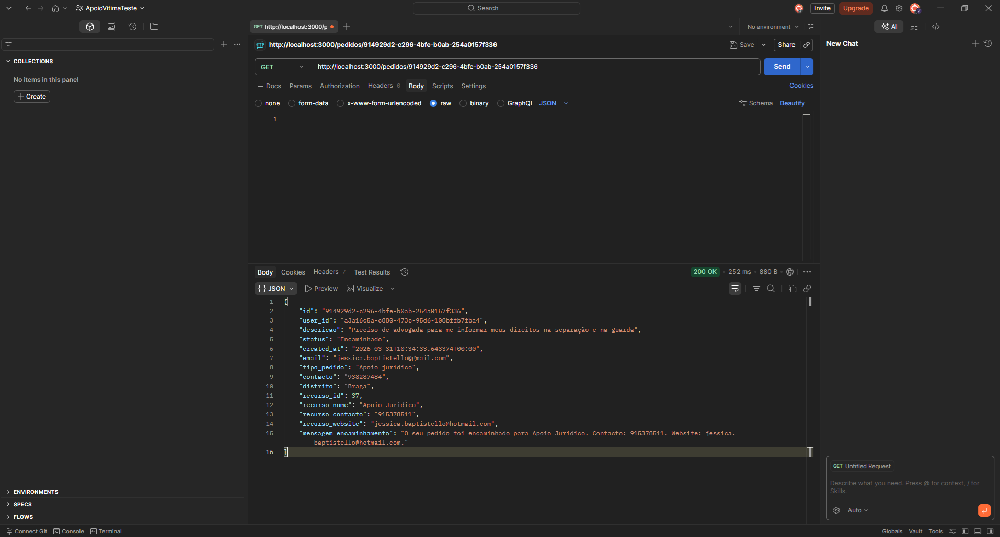
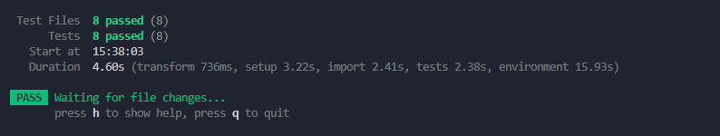

[](https://github.com/jessicabaptistello/Apoio_Vitima/actions/workflows/ci.yml)


[](https://apoio-vitima.onrender.com)


# Diretório de Apoio à Vítima

Aplicação web que permite consultar e adicionar recursos de apoio a vítimas de crime ou violência doméstica, organizados por tipo e distrito.

##  ODS

ODS 16 — Paz, Justiça e Instituições Eficazes
Este projeto facilita o acesso a informação essencial para vítimas encontrarem ajuda.

---

##  Stack Tecnológica

* Angular
* Node.js + Express
* Supabase (PostgreSQL)
* GitHub
* Postman

---

## Como correr o projeto

### Backend

```bash
cd backend
npm install
npm run dev
```

### Frontend

```bash
ng serve
```

---

## API Endpoints

### Recursos

- **GET /recursos**
  - Lista todos os recursos

- **GET /recursos/:id**
  - Obtém um recurso específico

- **POST /recursos**
  - Cria um novo recurso
    
  - Exemplo de body:
```json
{
  "nome": "APAV",
  "tipo": "Apoio psicológico",
  "contacto": "800 202 148",
  "distrito": "Lisboa"
}

- **PATCH /recursos/:id**
  - Atualiza um recurso existente

- **DELETE /recursos/:id**
  - Remove um recurso

---

### Pedidos

- **GET /pedidos**
  - Lista todos os pedidos

- **GET /pedidos/:id**
  - Obtém um pedido específico

- **POST /pedidos**
  - Cria um novo pedido

- **PATCH /pedidos/:id**
  - Atualiza um pedido

- **DELETE /pedidos/:id**
  - Remove um pedido

## Base de Dados

Tabela: Recursos

Campos:

* id
* nome
* tipo
* contacto
* website
* distrito
* descricao
* status

Tabela: Pedidos 

Campos:

* id
* user_id
* descricao
* status
* email
* tipo_pedido
* contacto
* distrito
* recurso_nome
* recurso_contacto
* recurso_website
* mensagem_encaminhamento

---

## Testes com Postman para a tabela Recursos

### GET /recursos


### GET /recursos/:id


### POST /recursos


### PATCH /recursos/:id


### DELETE /recursos/:id


---
## Testes com Postman para a tabela Pedidos

### GET /pedidos


### GET /pedidos/:id



### POST /pedidos


### PATCH /pedidos/:id


### DELETE /pedidos/:id


---

## Funcionalidades

* CRUD completo de recursos
* Filtros por tipo e distrito
* Pesquisa por palavra-chave
* Sistema de sugestão 

---

##  Testes Unitários

Foram executados testes unitários no frontend Angular com sucesso.

### Testes realizados
- Criação do componente principal da aplicação
- Criação do componente Home
- Criação do componente Login
- Criação do componente Dashboard
- Criação do componente Apoio
- Criação do componente de detalhe de recurso
- Criação do serviço Supabase
- Teste do pipe de saudação

### Comando utilizado
```bash
ng teste
```

##  Printscreen Testes



---

## Decisão de Design

A aplicação foi estruturada com base em duas entidades principais: **recursos** e **pedidos**.

Os **recursos** representam organizações, associações e linhas de apoio disponíveis, enquanto os **pedidos** representam situações de ajuda criadas pelos utilizadores.

Esta separação permite:
- organizar melhor a informação
- facilitar a gestão dos dados
- permitir um fluxo de encaminhamento entre pedidos e recursos

Além disso, foi utilizada a plataforma Supabase para gestão de base de dados e autenticação, permitindo simplificar o desenvolvimento e garantir segurança na gestão de utilizadores.

---

##  Estado do Projeto

Backend funcional com deploy automatico no Render: https://apoio-vitima.onrender.com

Frontend com deploy automatico no Vercel: https://apoio-vitima.vercel.app/

