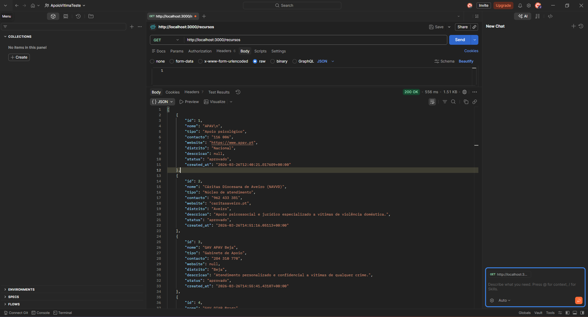
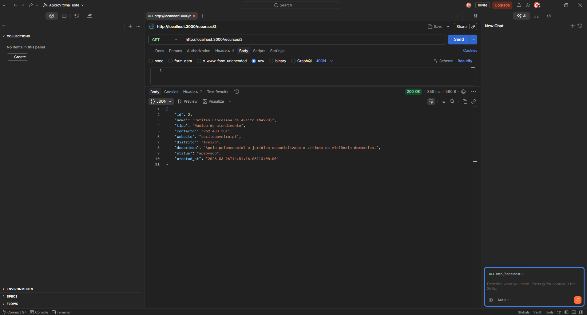
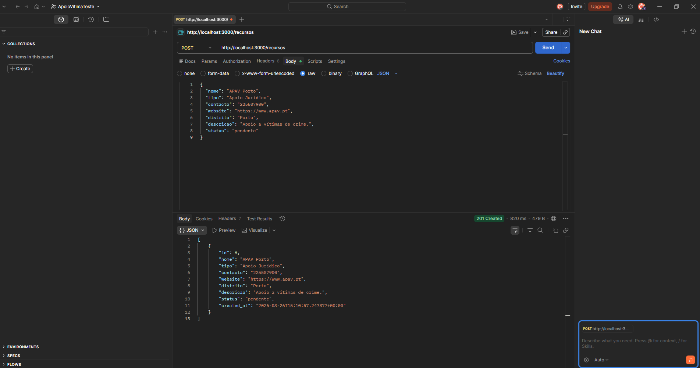
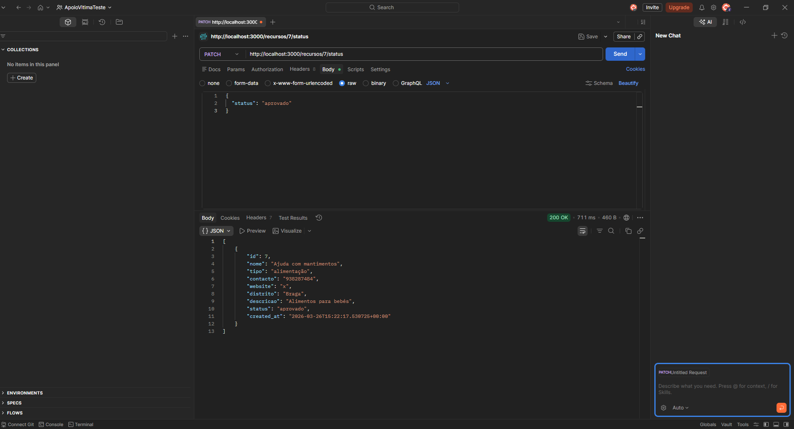
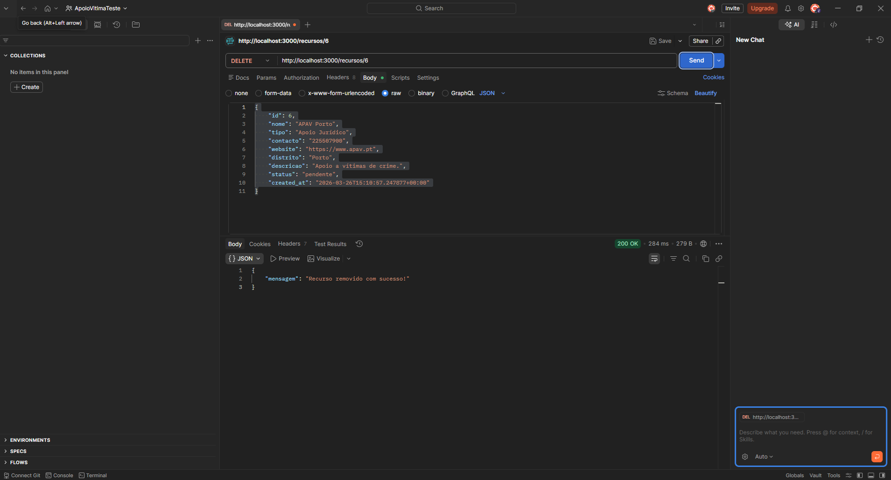
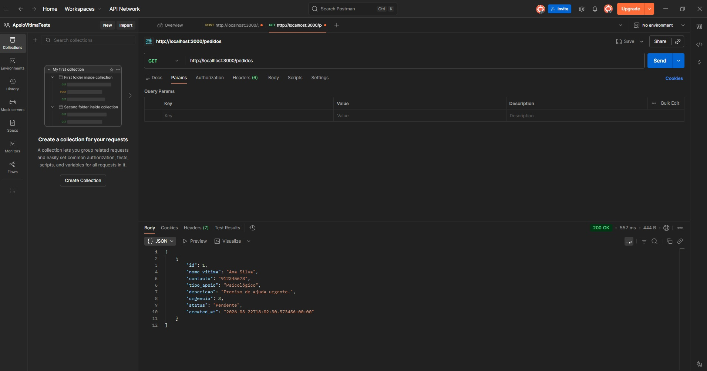
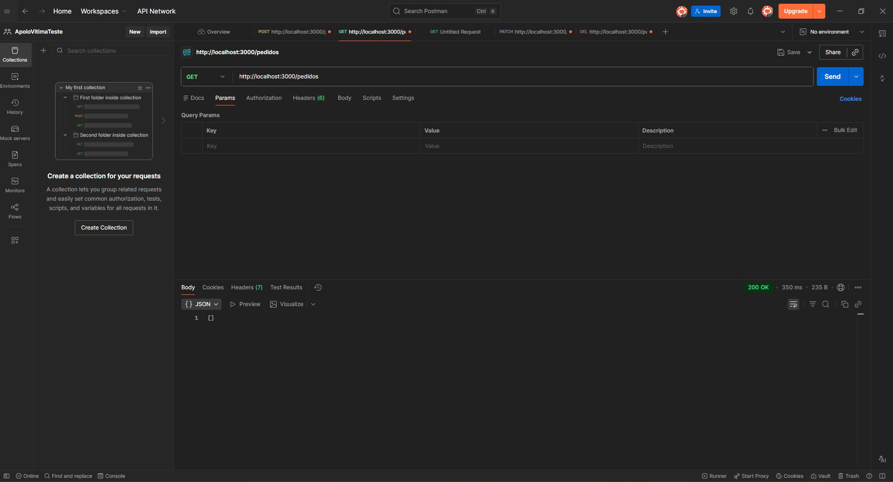
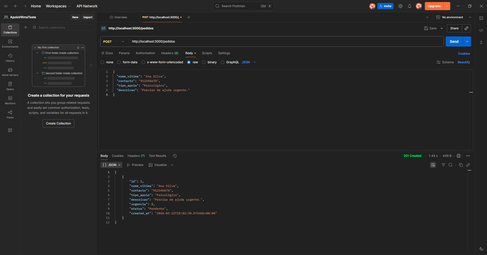
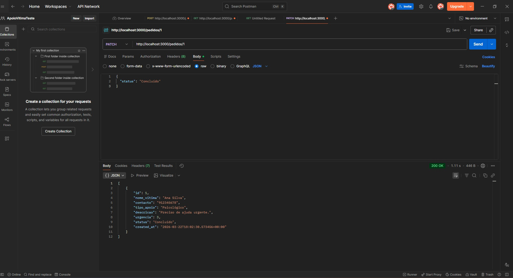
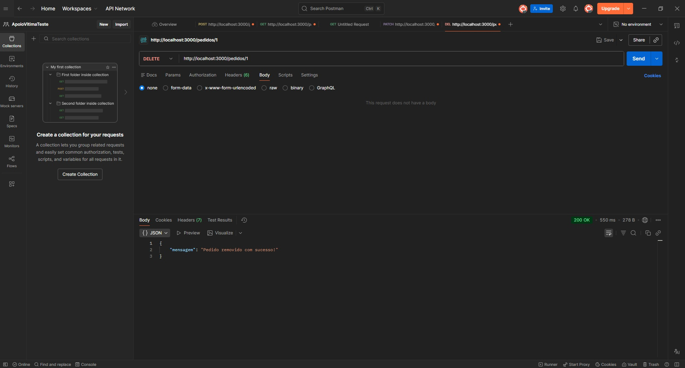

[](https://github.com/jessicabaptistello/Apoio_Vitima/actions/workflows/ci.yml)


[](https://dashboard.render.com)

# Diretório de Apoio à Vítima

Aplicação web que permite consultar e adicionar recursos de apoio a vítimas de crime ou violência doméstica, organizados por tipo e distrito.

##  ODS

ODS 16 — Paz, Justiça e Instituições Eficazes
Este projeto facilita o acesso a informação essencial para vítimas encontrarem ajuda.

---

##  Stack Tecnológica

* Angular
* Node.js + Express
* Supabase (PostgreSQL)
* GitHub
* Postman

---

## Como correr o projeto

### Backend

```bash
cd backend
npm install
npm run dev
```

Link do Render: https://apoio-vitima.onrender.com

### Frontend

```bash
ng serve
```

---

##  API Endpoints

### GET / RECURSOS E PEDIDOS

Lista todos os recursos

### GET / RECURSOS POR ID 

Obtém um recurso específico

### POST  / RECURSOS E ID 

Cria um novo recurso

### PATCH / RECURSOS E ID

Atualiza um recurso

### DELETE / RECURSOS E ID 

Remove um recurso

### GET / PEDIDOS APOS DELETE 

Tenta obter um recurso específico após o delete deste 
---

## Base de Dados

Tabela: Recursos

Campos:

* id
* nome
* tipo
* contacto
* website
* distrito

Tabela: Pedidos 

Campos:

* id
* user_id
* titulo
* descricao
* status

---

## Testes com Postman para a tabela Recursos

### GET todos os recursos



### GET por ID



### POST criar recurso



### PATCH atualizar recurso



### DELETE recurso



---
## Testes com Postman para a tabela Pedidos

### GET todos os recursos



### GET por APÓS DELETE



### POST criar recurso



### PATCH atualizar recurso



### DELETE recurso



---

## Funcionalidades

* CRUD completo de recursos
* Filtros por tipo e distrito
* Pesquisa por palavra-chave
* Sistema de sugestão 

---

##  Estado do Projeto

Backend funcional ✔️

Frontend em desenvolvimento 
